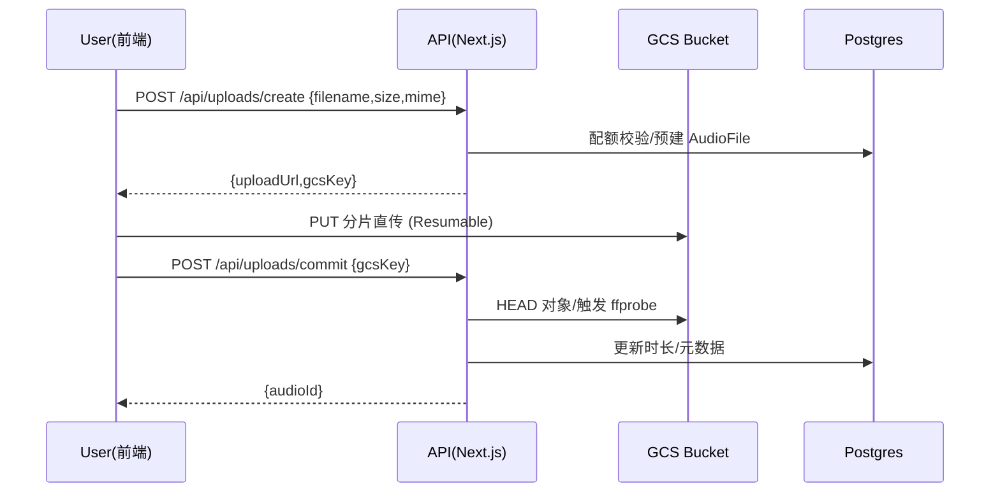
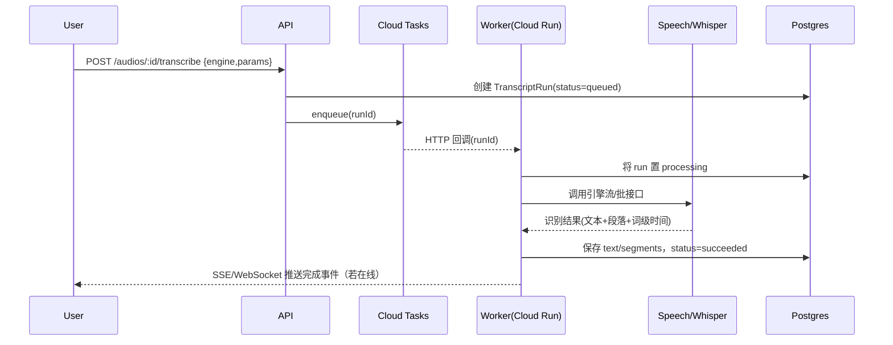

# LingoLoopAI 精听学习平台优化方案 v2.0

> 版本：v2.0
> 日期：2025-09-21 (JST)
> 负责人：产品/架构双签（待填）
> 适用范围：Web + 后端（API/Worker）；对象存储 GCS；转写引擎 Google Speech v2/Whisper；数据库 Postgres/Prisma。
> 文档目的：从音频转写工具转型为"精听训练平台"，明确北极星指标、合规转型、核心学习体验、订阅模式与增长策略，确保产品可持续性与教学效果。

---

## 0. 业务目标与衡量

### 0.1 战略转型

* 从"音频转写工具"升级为"精听训练平台"，打造"**工具+训练法+内容**"的合规模型。
* 实现**合规经营**（版权友好）与**教学效果**（10分钟精听循环）的双重价值。

### 0.2 北极星指标

**核心指标**：用户在**10分钟内完成一次完整精听循环**（听→跟读→打分→复盘→SRS），并且**周留存≥3次精听会话**。

**质量维度**：**有效精听率** = 完成精听的用户中，真正进行跟读/录音的比例 ≥80%

### 0.3 阶段性 KPI

**激活阶段（M1-M2）**
* D1：新用户 ≤10 分钟完成 1 次完整会话 ≥60%
* 首周：完成 ≥3 次会话占比 ≥40%

**留存阶段（M3-M4）**
* W2 留存 ≥25%，月活用户周均会话数 ≥4
* 跟读平均分提升（第1次 vs 第5次）≥15分

**转化阶段（M5-M6）**
* Free→Pro 首周转化 ≥3%
* Pro 续订率 ≥75%
* SRS 回访 7 天完成率 ≥60%

---

## 1. 合规转型与内容策略

### 1.1 版权友好模式

**不托管受版权保护内容**
* BBC 6 Minute English：仅做**元数据库**（标题/时长/主题/标签/难度），跳转官方收听
* 用户上传：**BYO 私有上传**模式，用户可上传自己合法音频，仅自己可见，默认不分享
* 示例素材池：内置 **VOA/Librivox/自制/CC BY** 音频，供所有人体验功能

**合规声明机制**
* 页脚与资源卡明确标注："**本站不托管/不分发 BBC 内容**"
* 新增 `/copyright` 页面：版权政策与免责声明
* 新增 `/takedown` 页面：侵权内容举报流程
* 上传页面增加合规勾选："我确认拥有此音频的使用权"

### 1.2 内容组织架构

```typescript
interface ContentMetadata {
  id: string;
  type: 'bbc' | 'user-upload' | 'sample' | 'shared';
  title: string;
  description?: string;
  durationMs: number;
  difficulty: 'beginner' | 'intermediate' | 'advanced';
  tags: string[];
  language: string;
  sourceUrl?: string; // 外部链接（BBC官方）
  isPublic: boolean; // 默认false
  uploadedBy?: string; // 用户ID
}
```

---

## 2. 核心学习体验设计

### 2.1 精听工作台（单页应用）

**黄金路径流程**
1. **音频选择** → 2. **A/B循环练习** → 3. **影子跟读** → 4. **智能打分** → 5. **错误复盘** → 6. **SRS入库**

**核心功能特性**

**键盘热键系统**
- `A/S/D`：设置循环起点/终点/取消循环
- `J/K/L`：减速播放/正常播放/加速播放（0.5x/1.0x/1.5x）
- `Space`：播放/暂停
- `←/→`：快退/快进5秒
- `Enter`：开始录音
- `Esc`：停止当前操作

**智能循环系统**
- 自动循环播放选中段落
- 循环次数可调（1-10次）
- 每次循环后间隔时间可调（0.5-3秒）
- 支持多段落连续循环

**实时录音与评分**
```typescript
interface RecordingSession {
  id: string;
  userId: string;
  audioId: string;
  segmentIndex: number;
  recordingUrl: string;
  durationMs: number;
  similarityScore: number; // 整体相似度 (0-100)
  wordScores: WordScore[]; // 词级评分
  rhythmScore?: number; // 节奏评分
  intonationScore?: number; // 语调评分
  feedback: string[]; // 改进建议
  createdAt: Date;
}

interface WordScore {
  word: string;
  startTime: number;
  endTime: number;
  similarity: number;
  issues: 'pronunciation' | 'rhythm' | 'missing' | 'extra'[];
}
```

### 2.2 练习模版系统

**六合一练习模式**
1. **精听训练**：传统精听，填写缺失词汇
2. **跟读打分**：录音对比，实时反馈
3. **听写练习**：逐句听写，自动判分
4. **复述训练**：听后复述，内容完整性检查
5. **同义替换**：关键词替换练习
6. **场景迁移**：应用到新语境中

**智能练习生成**
- 根据难度自动生成练习题
- 支持人工调整练习参数
- 练习历史跟踪与进度可视化

---

## 3. SRS与记忆管理

### 3.1 词块抽取系统

**智能词块识别**
```typescript
interface WordBlock {
  id: string;
  content: string; // 词块内容
  type: 'phrase' | 'collocation' | 'idiom' | 'pattern';
  source: string; // 来源句子
  translation?: string;
  difficulty: number; // 1-5
  frequency: number; // 出现频率
  context: {
    topic: string;
    scenario: string;
    exampleSentences: string[];
  };
}
```

**自动抽取规则**
- 高频词组（2-4词组合）
- 固定搭配（动词+介词等）
- 实用句型模板
- 用户自定义词块

### 3.2 间隔重复算法

**基于难度系数的SRS**
```typescript
interface SpacedRepetition {
  id: string;
  userId: string;
  wordBlockId: string;
  difficulty: number; // 难度系数 1.3-3.0
  interval: number; // 间隔天数
  repetition: number; // 重复次数
  easeFactor: number; // 轻松系数 1.3-2.5
  nextReview: Date;
  lastReview: Date;
  performanceHistory: number[]; // 历史评分
  reviewCount: number;
}

// SM-2算法变种
function calculateNextReview(sr: SpacedRepetition, quality: number): SpacedRepetition {
  if (quality < 3) {
    sr.repetition = 0;
    sr.interval = 1;
  } else {
    if (sr.repetition === 0) sr.interval = 1;
    else if (sr.repetition === 1) sr.interval = 6;
    else sr.interval = Math.round(sr.interval * sr.easeFactor);
    sr.repetition++;
  }

  sr.easeFactor = Math.max(1.3, sr.easeFactor + 0.1 - (5 - quality) * (0.08 + (5 - quality) * 0.02));
  sr.nextReview = new Date(Date.now() + sr.interval * 24 * 60 * 60 * 1000);
  return sr;
}
```

### 3.3 每日巩固系统

**一分钟微练**
- 每次会话结束推送60秒巩固练习
- 3题听写 + 2句复述
- 基于用户错误率的个性化推送
- 支持离线完成

**错题本管理**
- 自动收集错误词块
- 按错误类型分类
- 针对性强化练习
- 错误率下降后自动归档

---

## 4. 订阅与商业化

### 4.1 三层订阅模式

**Free（免费版）**
- 每日3次会话，总计≤30分钟
- 基础精听功能
- 不含词级打分/导出/异步长音频
- 限制SRS词块数量（50个）

**Pro（专业版）- 月费¥19.9**
- 每月1,000分钟练习时间
- 解锁词级对齐与打分
- 导出功能（TXT/SRT/CSV/Anki）
- 优先处理队列
- 学习报告与数据分析
- 无限SRS词块

**Teacher（教师版）- 按席位**
- 5席位：¥99/月
- 10席位：¥189/月
- 班级作业管理
- 批量导出功能
- 难点热区图分析
- 家长/学员周报

**加油包（按需购买）**
- 100分钟：¥9.9
- 500分钟：¥39.9
- 2000分钟：¥129.9

### 4.2 升级触发机制

**配额触发**
- 超出当日配额时弹出升级提示
- 显示"本周已练习X分钟，升级后可再练习Y分钟"

**功能触发**
- 尝试使用Pro功能时弹出提示
- "词级打分需要Pro版本，立即升级？"

**情境触发**
- 连续学习7天后弹出"周体验卡"优惠
- 学习效果明显时提示"继续保持，Pro版帮你定制学习计划"

**社交触发**
- 邀请好友双方获得额外练习时间
- 分享学习成果获得时长奖励

---

## 5. 增长与留存策略

### 5.1 游戏化机制

**7天精听挑战**
- 每天6分钟×1次流程
- 完成送"词块包"与进阶功能试用48h
- 挑战成功者获得专属徽章

**连续天数系统**
- 坚持徽章：3天、7天、30天、100天
- 番茄钟机制：每6分钟为一枚"豆子"
- 周目标自动拆解：周目标→每日目标→单次目标

**成就系统**
- 学习时长成就（1小时、10小时、100小时）
- 跟读质量成就（平均分达到80/90/95分）
- 词块掌握成就（掌握100/500/1000个词块）
- 社交成就（分享次数、邀请好友数）

### 5.2 社交分享

**进度分享卡**
- 自动生成学习成果图片
- 适配小红书比例（4:5和16:9）
- 仅包含个人数据，不含版权内容
```typescript
interface ShareCard {
  userId: string;
  type: 'daily' | 'weekly' | 'achievement';
  data: {
    totalMinutes: number;
    sessionsCount: number;
    averageScore: number;
    streakDays: number;
    wordsMastered: number;
    personalNote?: string;
  };
  template: 'minimal' | 'detailed' | 'achievement';
}
```

**难点热力榜**
- 匿名汇总"最难的10句话/音变点"
- 生成训练入口，提高公共练习粘性
- "本周大家都觉得这句话难，来挑战一下？"

### 5.3 个性化推送

**智能学习助理**
- 每天推送"你的错音TOP3 + 1分钟巩固链接"
- 学习习惯提醒（"该练习了"推送）
- 进度报告（周报、月报）

**邮件营销**
- 学习周报：本周学习数据、进步亮点
- 复习提醒：需要复习的词块列表
- 优惠活动：节假日特别优惠

---

## 6. 技术架构优化

### 6.1 新增数据模型

```sql
-- 扩展现有Prisma schema
model LearningSession {
  id          String   @id @default(uuid())
  userId      String
  audioId     String
  type        SessionType
  duration    Int      // 实际练习时长（秒）
  completion  Float    // 完成度 0-100
  metadata    Json?    // 会话详情
  createdAt   DateTime @default(now())

  user  User      @relation(fields: [userId], references: [id])
  audio AudioFile @relation(fields: [audioId], references: [id])
}

model WordBlock {
  id          String   @id @default(uuid())
  content     String   // 词块内容
  type        WordBlockType
  source      String   // 来源句子
  translation String?
  difficulty  Int      // 1-5
  frequency   Int      // 出现频率
  context     Json?    // 上下文信息
  createdAt   DateTime @default(now())

  // 关联关系
  srsItems SpacedRepetition[]
}

model SpacedRepetition {
  id            String   @id @default(uuid())
  userId        String
  wordBlockId   String
  difficulty    Float    // 难度系数 1.3-3.0
  interval      Int      // 间隔天数
  repetition    Int      // 重复次数
  easeFactor    Float    // 轻松系数 1.3-2.5
  nextReview    DateTime // 下次复习时间
  lastReview    DateTime // 最后复习时间
  performance   Json?    // 历史评分记录
  reviewCount   Int      @default(0)
  createdAt     DateTime @default(now())

  user     User      @relation(fields: [userId], references: [id])
  wordBlock WordBlock @relation(fields: [wordBlockId], references: [id])

  @@unique([userId, wordBlockId])
}

model RecordingSession {
  id            String   @id @default(uuid())
  userId        String
  audioId       String
  segmentIndex  Int
  recordingUrl  String
  durationMs    Int
  similarityScore Float   // 整体相似度
  wordScores    Json     // 词级评分详情
  feedback      Json     // 改进建议
  createdAt     DateTime @default(now())

  user  User      @relation(fields: [userId], references: [id])
  audio AudioFile @relation(fields: [audioId], references: [id])
}

enum SessionType {
  LOOP_PRACTICE    // 循环练习
  SHADOWING        // 影子跟读
  DICTATION        // 听写练习
  RETELLING        // 复述训练
  REVIEW           // 复习巩固
}

enum WordBlockType {
  PHRASE          // 短语
  COLLOCATION     // 搭配
  IDIOM           // 习语
  PATTERN         // 句型
  CUSTOM          // 自定义
}
```

### 6.2 前端架构优化

**组件化重构**
```
components/
├── ListeningWorkbench/          # 精听工作台
│   ├── AudioPlayer.tsx          # 音频播放器
│   ├── LoopController.tsx       # 循环控制器
│   ├── RecordingPanel.tsx       # 录音面板
│   ├── ScoringDisplay.tsx       # 评分显示
│   └── KeyboardShortcuts.tsx    # 热键系统
├── PracticeTemplates/           # 练习模版
│   ├── DictationPractice.tsx    # 听写练习
│   ├── ShadowingPractice.tsx    # 跟读练习
│   └── RetellingPractice.tsx    # 复述练习
├── SRS/
│   ├── ReviewCard.tsx           # 复习卡片
│   ├── ProgressChart.tsx        # 进度图表
│   └── WordBlockList.tsx        # 词块列表
└── Sharing/
    ├── ShareCardGenerator.tsx   # 分享卡片生成
    └── SocialShare.tsx          # 社交分享
```

**状态管理升级**
```typescript
// 全局状态类型定义
interface GlobalState {
  user: User;
  currentSession: LearningSession | null;
  audioQueue: AudioFile[];
  practiceSettings: PracticeSettings;
  srsQueue: SpacedRepetition[];
  ui: {
    isRecording: boolean;
    isPlaying: boolean;
    currentLoop: { start: number; end: number } | null;
    keyboardShortcuts: Map<string, () => void>;
  };
}

interface PracticeSettings {
  defaultLanguage: string;
  loopCount: number;
  loopInterval: number;
  playbackSpeed: number;
  scoringSensitivity: 'strict' | 'normal' | 'lenient';
  autoAdvance: boolean;
}
```

### 6.3 性能优化方案

**音频处理优化**
- 前端波形生成：Web Audio API + Canvas
- 音频分片上传：支持断点续传
- HLS预览流：长音频快速预览
- Service Worker缓存：离线音频支持

**实时评分优化**
```typescript
// 前端轻量评分算法
class RealTimeScorer {
  private audioContext: AudioContext;
  private analyser: AnalyserNode;

  constructor() {
    this.audioContext = new AudioContext();
    this.analyser = this.audioContext.createAnalyser();
  }

  // 简单相似度计算（前端实时反馈）
  calculateSimilarity(original: Float32Array, recorded: Float32Array): number {
    const correlation = this.calculateCrossCorrelation(original, recorded);
    return Math.max(0, Math.min(100, correlation * 100));
  }

  private calculateCrossCorrelation(signal1: Float32Array, signal2: Float32Array): number {
    // 实现互相关算法
    // 简化版本，实际可使用DTW算法
    const minLength = Math.min(signal1.length, signal2.length);
    let sum = 0;
    for (let i = 0; i < minLength; i++) {
      sum += signal1[i] * signal2[i];
    }
    return sum / minLength;
  }
}
```

**数据库优化**
- 分页查询优化：cursor-based pagination
- 索引策略：复合索引 + GIN索引
- 读写分离：统计查询走只读副本
- 缓存策略：Redis缓存热门内容

---

## 7. 实施路线图

### 7.1 Phase 1：基础建设（4-6周）

**Week 1-2：合规转型**
- [ ] 移除站内BBC音频托管
- [ ] 新增版权声明和takedown流程
- [ ] 实现元数据库（BBC索引）
- [ ] 上传页面合规化改造

**Week 3-4：精听工作台基础**
- [ ] 重构TranscriptPlayer组件
- [ ] 实现键盘热键系统
- [ ] A/B循环功能
- [ ] 基础录音功能

**Week 5-6：示例素材池**
- [ ] 集成VOA/CC BY音频
- [ ] 素材管理后台
- [ ] 内容审核流程
- [ ] 基础练习模版

### 7.2 Phase 2：核心功能（6-8周）

**Week 7-8：SRS系统**
- [ ] 词块抽取算法
- [ ] 间隔重复引擎
- [ ] 复习队列管理
- [ ] 每日巩固功能

**Week 9-10：智能评分**
- [ ] 实时相似度评分
- [ ] 词级时间轴对齐
- [ ] 错误分析算法
- [ ] 改进建议生成

**Week 11-12：订阅系统**
- [ ] 定价页面
- [ ] 支付集成
- [ ] 配额管理
- [ ] 升级触发机制

### 7.3 Phase 3：增长功能（4-6周）

**Week 13-14：游戏化**
- [ ] 7天挑战系统
- [ ] 成就徽章
- [ ] 连续天数统计
- [ ] 进度可视化

**Week 15-16：社交分享**
- [ ] 分享卡片生成
- [ ] 难点热力榜
- [ ] 邀请机制
- [ ] 社交媒体集成

**Week 17-18：数据分析**
- [ ] 学习报告
- [ ] 效果分析
- [ ] 个性化推荐
- [ ] 管理后台

---

## 8. 风险控制与质量保障

### 8.1 合规风险

**版权风险控制**
- 严格审核用户上传内容
- 自动内容识别系统
- 快速响应takedown请求
- 定期合规审计

**数据隐私保护**
- GDPR合规的数据处理
- 用户数据导出/删除功能
- 录音数据自动过期机制
- 加密存储敏感信息

### 8.2 技术风险

**性能风险控制**
- 服务端监控：响应时间、错误率
- 客户端监控：崩溃率、卡顿率
- 容量规划：并发用户数预估
- 降级策略：核心功能优先

**质量保障措施**
- 自动化测试：单元测试、集成测试
- 性能测试：负载测试、压力测试
- 兼容性测试：多浏览器、多设备
- A/B测试：关键功能迭代优化

### 8.3 用户体验风险

**学习效果保障**
- 教学方法有效性验证
- 用户学习效果跟踪
- 基于数据的算法优化
- 用户反馈快速响应机制

**留存率保障**
- 新用户引导流程优化
- 核心价值快速传递
- 个性化推荐算法
- 用户分层运营策略

---

## 9. 指标监控与迭代

### 9.1 核心指标监控

**激活指标**
- 注册转化率：访问→注册的比例
- 首次会话完成率：新用户完成首次精听的比例
- 10分钟内完成率：能否在目标时间内完成流程

**留存指标**
- 次日留存、7日留存、30日留存
- 周均会话次数
- 平均会话时长
- 功能使用深度

**转化指标**
- Free→Pro转化率
- 付费用户ARPU
- 续订率、流失率
- LTV（用户生命周期价值）

**教学效果指标**
- 跟读分数提升趋势
- 词块掌握数量增长
- SRS复习完成率
- 用户自评进步程度

### 9.2 数据驱动迭代

**用户行为分析**
- 关键路径转化漏斗
- 功能使用热力图
- 用户分群分析
- 流失原因分析

**A/B测试框架**
- 核心功能迭代验证
- UI/UX优化测试
- 定价策略测试
- 增长策略验证

**快速反馈机制**
- 用户反馈收集系统
- 客服问题分类统计
- 社交媒体舆情监控
- 竞品动态跟踪

---

## 10. 团队与资源需求

### 10.1 团队配置

**核心团队（4-6人）**
- 产品经理×1：负责产品规划和用户体验
- 全栈工程师×2：前端和后端开发
- 算法工程师×1：音频处理和推荐算法
- UI/UX设计师×1：界面设计和用户体验
- 运营专员×1：用户增长和内容运营

**外包合作**
- 音频内容采购：CC BY素材获取
- 法律咨询：版权合规咨询
- 测试外包：功能测试和兼容性测试

### 10.2 技术栈需求

**开发工具**
- 前端：Next.js 14 + React 18 + TypeScript
- 后端：Next.js API Routes + Prisma
- 数据库：PostgreSQL + Redis
- 云服务：Google Cloud Platform

**第三方服务**
- 音频处理：Google Speech-to-Text
- 对象存储：Google Cloud Storage
- 邮件服务：SendGrid或类似
- 支付服务：Stripe或本地支付

**监控分析**
- 前端监控：Sentry
- 后端监控：Cloud Monitoring
- 用户行为分析：自建分析系统
- A/B测试：自建实验平台

---

## 11. 财务预测与ROI

### 11.1 成本结构

**固定成本（月）**
- 服务器费用：$500-1000
- 第三方服务：$300-500
- 人员成本：$15,000-25,000
- 办公运营：$2,000-3,000

**可变成本**
- 音频处理：$0.006/分钟（Google Speech）
- 存储费用：$0.026/GB/month（GCS）
- 带宽费用：$0.08-0.12/GB
- 支付手续费：3%左右

### 11.2 收入预测

**保守估计（第一年）**
- 用户规模：10,000注册用户，1,000活跃用户
- 付费转化：5%，50个付费用户
- ARPU：$15/月
- 月收入：$750

**乐观估计（第一年）**
- 用户规模：50,000注册用户，8,000活跃用户
- 付费转化：10%，800个付费用户
- ARPU：$20/月
- 月收入：$16,000

### 11.3 盈亏平衡分析

**盈亏平衡点**
- 月固定成本：$20,000
- 毛利率：70%
- 需要月收入：$28,500
- 需要付费用户：1,425（$20/用户）

**投资回报期**
- 开发投入：6个月 × $25,000 = $150,000
- 预计回本期：12-18个月

---

## 12. 附录：详细技术规范

### 12.1 API接口规范

**精听工作台相关**
```typescript
// POST /api/sessions/start - 开始新的学习会话
interface StartSessionRequest {
  audioId: string;
  type: SessionType;
  settings: PracticeSettings;
}

// POST /api/sessions/:sessionId/record - 录音评分
interface RecordingRequest {
  segmentIndex: number;
  recordingBlob: Blob;
  expectedText?: string;
}

// GET /api/srs/queue - 获取复习队列
interface SRSQueueResponse {
  items: SpacedRepetition[];
  totalCount: number;
  estimatedTime: number; // 预计完成时间（分钟）
}
```

**词块管理相关**
```typescript
// POST /api/word-blocks/extract - 自动抽取词块
interface ExtractWordBlocksRequest {
  text: string;
  difficulty?: 'auto' | 'beginner' | 'intermediate' | 'advanced';
  maxCount?: number;
}

// PUT /api/word-blocks/:id/learn - 标记词块已学习
interface LearnWordBlockRequest {
  quality: number; // 1-5
  context?: string;
  notes?: string;
}
```

### 12.2 数据库索引优化

```sql
-- 学习会话查询优化
CREATE INDEX idx_learning_sessions_user_created ON learning_sessions(user_id, created_at DESC);
CREATE INDEX idx_learning_sessions_audio ON learning_sessions(audio_id);

-- SRS查询优化
CREATE INDEX idx_srs_next_review ON spaced_repetition(next_review, user_id);
CREATE INDEX idx_srs_word_block ON spaced_repetition(word_block_id);

-- 录音评分查询优化
CREATE INDEX idx_recordings_session ON recording_sessions(session_id);
CREATE INDEX idx_recordings_user_score ON recording_sessions(user_id, similarity_score DESC);

-- 词块搜索优化
CREATE INDEX idx_word_blocks_content ON word_blocks USING gin(to_tsvector('english', content));
CREATE INDEX idx_word_blocks_frequency ON word_blocks(frequency DESC, difficulty);
```

### 12.3 前端性能预算

**页面加载时间**
- 首屏加载：<2秒
- 交互准备：<3秒
- 完全加载：<5秒

**运行时性能**
- FPS：≥45
- 内存使用：<100MB
- CPU使用：<30%

**网络性能**
- API响应：<300ms
- 静态资源：<1MB
- 音频加载：<1秒（预加载时）

---

## 13. 总结与下一步行动

### 13.1 核心价值主张

LingoLoopAI通过"10分钟精听循环"的创新模式，解决了语言学习者的核心痛点：

1. **时间效率**：碎片化时间高效利用
2. **学习效果**：科学方法确保学习质量
3. **合规安全**：版权友好的商业模式
4. **可持续性**：清晰的商业化路径

### 13.2 竞争优势

**技术优势**
- 音频处理技术积累
- 智能评分算法
- SRS记忆系统
- 个性化推荐

**产品优势**
- 完整的学习闭环
- 游戏化学习体验
- 社交化传播机制
- 多层次订阅模式

**商业模式优势**
- 工具+服务双重价值
- 可扩展的定价策略
- 清晰的用户分层
- 多元化收入来源

### 13.3 立即行动清单

**本周内启动**
1. 成立专项团队，明确分工
2. 细化技术方案和排期
3. 采购示例素材资源
4. 设计版权合规流程

**30天内完成**
1. 合规转型基础架构
2. 精听工作台原型
3. 用户测试和反馈收集
4. 迭代优化核心流程

**90天内目标**
1. 完整产品功能上线
2. 获取1000个种子用户
3. 验证核心假设（10分钟精听循环）
4. 建立增长模型和 metrics

---

> 本方案为LingoLoopAI从音频转写工具向精听学习平台转型的完整规划，涵盖战略定位、产品设计、技术实现、商业化路径等全方面内容。团队将根据实际执行情况和市场反馈进行动态调整和优化。

---

## 1. 用户与权限

### 1.1 角色

* **Learner（学习者）**：上传、查看、重识别、批注、导出、自删。
* **Coach/Teacher（教师/教练）**：与 Learner 相同；后续可加入 Workspace（非本版）。
* **Admin（可选）**：全局查看与治理（审计/清理/统计）。

### 1.2 权限矩阵（M1 范围）

| 能力        | 未登录      | Learner | Admin |
| --------- | -------- | ------- | ----- |
| 上传 & 即返   | ✅（匿名会话）  | ✅       | ✅     |
| 登录/注册     | ✅        | ✅       | ✅     |
| 历史列表      | ❌        | ✅（仅本人）  | ✅（全局） |
| 详情/播放/下载  | ❌        | ✅（仅本人）  | ✅     |
| 转写（同步/异步） | ✅（匿名仅同步） | ✅       | ✅     |
| 版本/批注     | ❌        | ✅       | ✅     |
| 删除/导出     | ❌        | ✅（仅本人）  | ✅     |

> 说明：匿名资源可在“绑定迁移”后（claim）转至登录用户名下（见 §10）。

---

## 2. 范围与非目标

### 2.1 本期范围（M1–M2）

1. 账户：邮箱密码 + Google/Apple OAuth；邮箱验证、找回/重设密码。
2. 上传：GCS 私有桶直传（Resumable），进度条、失败续传；入库元数据。
3. 转写：短音频同步；长音频异步（Cloud Tasks→Worker）；状态机与错误保存。
4. 历史：列表（分页/搜索/标签）、详情（播放器+转写按段懒加载）。
5. 版本&批注：Run（参数/版本）+ Revision（手动编辑副本）+ Annotation（时间锚点）。
6. 下载/导出：音频签名 URL、文本/JSON/SRT/VTT 导出。
7. 配额：单文件上限、每日上传数、当日总时长；提示升级/联系。
8. 安全&合规：HTTPS、最小权限、GDPR 删除/导出、审计日志。

### 2.2 非目标（后续版本）

* Workspace/Org 多人协作（成员/角色/共享链接）；
* 术语表、词典自定义、跟读打分；
* 移动 App；
* 计费/订阅体系；
* 多引擎投票融合/质量评估。

---

## 3. 关键流程（时序）

### 3.1 直传与入库



### 3.2 长音频异步转写



---

## 4. 功能需求与验收标准（AC）

### 4.1 账户与鉴权

**需求**

* 邮箱+密码注册/登录；Google/Apple OAuth；邮箱验证；忘记密码邮件；会话 JWT/cookie；登出。
  **AC**

1. 未验证邮箱用户登录后，上传/转写不受限，但导出/分享（若有）受限（M1 可选）。
2. 密码重设链接 15–30 分钟有效；过期二次申请将失效旧链接。
3. 所有认证/重置邮件带 traceId，记录送达与打开。
4. Session 过期（默认 7 天可刷新），刷新失败统一 401。

### 4.2 用户资料与设置

**需求**

* 昵称、头像、默认语言、默认模型、停顿阈值等可选项。
  **AC**

1. 修改设置立即生效；新建转写默认采用设置值，可在请求中覆写。
2. 头像支持外链或上传（限制 2MB，png/jpg/webp）。

### 4.3 上传与存储

**需求**

* GCS 私有桶直传（Resumable）；断点续传；多文件并发；进度提示；入库 metadata。
  **AC**

1. 失败续传不重复计入配额；完成后 `ffprobe` 得到时长（误差≤100ms）。
2. 命名：`audio/{userId}/{yyyy}/{mm}/{uuid}-{safeFilename}`。
3. MIME 白名单：`audio/*`, `video/mp4`（仅音轨提取，后续版本）。

### 4.4 转写结果管理

**需求**

* TranscriptRun：多版本；记录 engine/params；状态机；错误持久化；文本 & 段落 & 词级时间；说话人数量（可选）。
  **AC**

1. 同一 `audioId + paramsHash` 保证幂等（去重）；
2. 失败 run 保留 `error`，支持一键重试（复用或修改参数）；
3. 文本全文 `text` 与 `segments` 同步生成；segments 可分页（见 §6.4）。

### 4.5 历史列表与检索

**需求**

* 列表分页/时间筛选/模糊搜索（文件名/标签）；详情页播放/查看转写/下载音频或文本；时间轴渲染。
  **AC**

1. 列表默认按更新时间倒序；分页 20 条；
2. 详情页文本分段虚拟滚动，滚动到视口自动预取相邻 2 页；
3. 选中文段可驱动播放器跳转（±200ms 对齐）。

### 4.6 标注/编辑

**需求**

* Annotation：锚定时间点；
* Revision：从某 run 生成“可编辑副本”，不改动原始 run。
  **AC**

1. 批注按时间排序；删除仅软删；
2. Revision 保存 title、全文与 segments；历史版本可回看。

### 4.7 下载/导出

**需求**

* 音频 Signed URL（有效期 5–10 分钟）；文本导出 TXT/JSON/SRT/VTT。
  **AC**

1. 非资源属主请求签名 URL 一律 403；
2. SRT/VTT 时间码与播放器实测对齐误差 ≤ 50ms。

### 4.8 通知与实时

**需求**

* 转写完成站内提示（SSE/WebSocket），邮件可选。
  **AC**

1. 在线会话收到完成事件 ≤ 1s；
2. 邮件模板可配置（见附录）。

### 4.9 配额与限制

**需求**

* 单文件大小（默认 100MB/30min）、每日上传次数、每日可转写总时长。
  **AC**

1. 超限返回 429，body 含剩余额度与重置时间；
2. Usage 统计在事务内原子累加，保证与任务去重一致。

---

## 5. 非功能需求（NFR）

* **可用性**：服务可用 99.9%；
* **性能**：

  * 列表 API P95 ≤ 300ms（不含网络）；
  * 详情首屏 P95 ≤ 800ms；
  * 段落分页拉取 P95 ≤ 200ms；
* **扩展性**：Cloud Run 自动扩缩；Worker/API 分离；
* **安全**：HTTPS 全链路；服务账号最小权限；CSRF 保护；
* **隐私**：GDPR 删除/导出（见 §9）。

---

## 6. 数据模型与索引

### 6.1 核心表（摘）

* `users(id,email,passwordHash,displayName,avatarUrl,emailVerified,settings,createdAt)`
* `audio_files(id,user_id,gcs_uri,filename,duration_ms,size_bytes,language,mode,status,meta,created_at)`
* `transcript_runs(id,audio_id,version,engine,params,status,error,text,segments,speaker_count,created_at,completed_at)`
* `transcript_revisions(id,run_id,title,text,segments,created_at)`
* `annotations(id,run_id,user_id,content,at_ms,created_at)`
* `audio_tags(id,audio_id,key,created_at)`
* `usage(id,user_id,day,upload_count,duration_ms)`
* `audit_log(id,user_id,kind,target_id,meta,created_at)`

### 6.2 约束

* FK：`audio_files.user_id -> users.id`；`transcript_runs.audio_id -> audio_files.id`；
* 唯一：`transcript_runs(audio_id, params_hash)`（逻辑层保证）；
* 索引：

  * 列表：`audio_files(user_id, created_at desc)`；
  * 检索：`GIN(to_tsvector('simple', transcript_runs.text))`（M2）；
  * 运行态：`transcript_runs(audio_id,status,created_at)`。

### 6.3 数据体量与分页

* `segments` 可能较大，采用**段落分页**：参数 `cursor=segmentIndex&limit=50`。

### 6.4 JSON 结构（segments）

```json
{
  "segments": [
    {
      "idx": 0,
      "start_ms": 0,
      "end_ms": 2450,
      "speaker": "S1",
      "text": "...",
      "words": [
        {"w":"hello","s":0,"e":320},
        {"w":"world","s":330,"e":650}
      ]
    }
  ],
  "meta": {"source":"google_speech_v2","diarize":false}
}
```

---

## 7. API 契约（REST）

> 所有受保护接口需携带 cookie/JWT；错误统一：`{code, message, details?, traceId}`。

### 7.1 账户

* `POST /api/auth/register` `{email,password,displayName}` → `201`
* `POST /api/auth/login` `{email,password}` → `200 {user}`
* `POST /api/auth/request-password-reset` `{email}` → `204`
* `POST /api/auth/reset-password` `{token,newPassword}` → `204`
* `GET /api/me` → `{id,email,displayName,settings}`
* `PATCH /api/me` `{displayName?,avatarUrl?,settings?}` → `200`

### 7.2 上传

* `POST /api/uploads/create` `{filename,sizeBytes,mime}` → `{uploadUrl,gcsKey,audioId}`
* `POST /api/uploads/commit` `{gcsKey}` → `{audioId,durationMs,language?}`

### 7.3 音频与转写

* `GET /api/audios?query=&from=&to=&tag=&page=` → `{items,total,page,pageSize}`
* `GET /api/audios/:audioId` → `{audio,...,latestRun}`
* `DELETE /api/audios/:audioId` → `204`
* `POST /api/audios/:audioId/transcribe` `{engine,params}` → `{runId,status}`
* `GET /api/runs/:runId` → `{status,engine,params,text?}`
* `GET /api/runs/:runId/segments?cursor=&limit=` → `{segments,nextCursor}`
* `POST /api/runs/:runId/revisions` `{title?,text,segments?}` → `{revisionId}`
* `GET /api/runs/:runId/revisions` → `{items}`
* `POST /api/runs/:runId/annotations` `{content,atMs?}` → `{id}`
* `GET /api/runs/:runId/annotations` → `{items}`
* `GET /api/audios/:audioId/download` → `{signedUrl,expiresAt}`
* `GET /api/runs/:runId/export?fmt=txt|json|srt|vtt` → 文件流

### 7.4 内部回调（Worker）

* `POST /internal/tasks/transcribe` `{runId}`（需服务账号+签名头） → `202`

---

## 8. 任务队列与状态机

**状态**：`queued → processing → (succeeded | failed | canceled)`

* Cloud Tasks：去重 key=`audioId+paramsHash`；最大重试 3 次，指数退避（5s, 30s, 2m）。
* 幂等：Worker 取 run 时检查状态，`processing` 再入避免重复；完成用事务写入。

---

## 9. 安全、隐私、合规

* HTTPS；Cookie `HttpOnly+Secure+SameSite=Lax`；CSRF token（非简单 POST）。
* GCS：私有桶；对象访问仅服务账号；下载以 **V4 签名 URL**（5–10 分钟）。
* 审计：`LOGIN/UPLOAD/TRANSCRIBE_START/TRANSCRIBE_DONE/DELETE/EXPORT`。
* 删除：软删即刻对用户隐藏；后台 7–30 天内物理删（含派生物）。
* GDPR：用户数据导出（Zip：音频可选、文本/JSON/SRT/VTT、元数据 CSV）。

---

## 10. 匿名到登录的迁移（Claim）

* 匿名态发放 `anon_session_id`（Cookie）；匿名上传绑定 `owner_session_id`。
* 登录后 `POST /api/claim`：将该会话下资源更名为 `userId` 所有；审计落 Log。

---

## 11. 前端 IA/页面与组件

* **/login**：邮箱/密码、OAuth、找回密码；
* **/dashboard**：最近音频卡片、快速上传、筛选与搜索；
* **/audio/\[id]**：

  * 左：播放器+元信息+操作（重识别/下载/删除）
  * 中：转写段落虚拟滚动，选中文段→播放器跳转
  * 右：运行版本切换（runs/revisions）、批注列表与新建
* **/settings**：资料与默认参数；
* **全局**：在线状态条（SSE/WebSocket）。

---

## 12. 埋点与监控

**客户端事件**：`login_success`, `upload_start/success/fail`, `transcribe_start/finish/fail`, `export_*`, `annotation_add`, `revision_create`。
**服务端指标**：QPS、P95、任务队列深度、失败率、回源率、签名 URL 403/404、成本估算（\$/min）。
**告警**：失败率>3%、队列积压>100、对象存储 5xx 增多。

---

## 13. 配额与套餐（占位）

* Free：每日 3 个上传，总时长 30 分钟，单文件 ≤ 100MB。
* Pro（占位）：每日 30 个上传，总时长 300 分钟，单文件 ≤ 500MB。

> 实际参数以配置中心为准；所有阈值通过环境变量/DB 可调。

---

## 14. 质量保障（QA）

### 14.1 关键用例（Gherkin 摘要）

```
Scenario: 登录后上传并同步转写
  Given 我已使用邮箱登录
  When 我上传一个 60s 的 mp3
  Then 我看到上传进度 0→100%
  And 上传完成后 3s 内详情页展示转写文本
  And 选中文段可驱动播放器跳转
```

```
Scenario: 长音频异步转写
  Given 我上传 12 分钟的 m4a 并点击“开始转写”
  When 我回到 Dashboard
  Then 我看到该音频状态为 processing
  And 10 分钟内我收到完成通知并能查看全文与段落
```

```
Scenario: 幂等与去重
  Given 我对同一音频以相同参数重复点击“转写”两次
  Then 系统仅创建一个运行并正确扣账/计入使用量一次
```

```
Scenario: 权限隔离
  Given 用户A 上传的音频
  When 用户B 通过猜测 ID 访问详情
  Then 返回 404/403 且无签名 URL 生成
```

### 14.2 兼容与回归

* 浏览器：Chrome/Edge/Safari 最新两个大版本；
* 文件格式：mp3/m4a/wav；
* 极端：0 字节、超大文件、网络中断恢复、任务失败重试。

---

## 15. 上线计划与回滚

* **灰度**：按用户ID hash 位 10%→30%→100%；
* **监控闸门**：任务失败率/签名 URL 错误/队列深度三指标任一触发→自动降级（关闭异步仅保留同步）；
* **回滚**：保持 DB 迁移可逆（down 脚本），对象存储不做破坏性变更；
* **数据备份**：每日快照 + PITR。

---

## 16. 风险与对策

* **引擎限流/配额**：并发阈值与队列溢出保护；备用 Whisper；
* **巨大 segments JSON**：按段分页与懒加载；
* **成本激增**：GCS 生命周期、预览转码、缓存命中与 Signed URL 复用窗口；
* **隐私投诉/GDPR**：一键导出/删除与审计明细；
* **匿名滥用**：验证码/速率限制、IP 黑名单、匿名仅同步限制。

---

## 17. 里程碑与交付物

### M1（2周）最小闭环

* NextAuth（邮箱+Google）
* 直传 GCS（Resumable）+ 入库 + ffprobe
* 短音频同步转写（Google Speech v2），TranscriptRun 落库
* Dashboard 列表 + 详情页（播放器+文本渲染）
* 基础配额 + 审计

### M2（2周）稳态异步

* Cloud Tasks/Worker + 状态机
* 段落分页 + 虚拟滚动 + SSE/WebSocket
* 导出 TXT/JSON/SRT/VTT + 签名 URL 下载
* 批注/Revision + 搜索/标签

### M3（2周）体验与合规

* 邮件通知 + Admin 概览
* GDPR 导出/删除 + GCS 生命周期
* 指标看板 & 告警

---

## 18. 错误码（示例）

| code            | http | 描述            |
| --------------- | ---: | ------------- |
| AUTH\_401       |  401 | 未登录或会话失效      |
| AUTH\_403       |  403 | 无权限访问资源       |
| UPLOAD\_413     |  413 | 文件超出限制        |
| UPLOAD\_429     |  429 | 当日配额不足        |
| TRANSCRIBE\_400 |  400 | 参数非法          |
| TRANSCRIBE\_409 |  409 | 幂等冲突（已存在等价运行） |
| TRANSCRIBE\_500 |  500 | 引擎内部错误        |

错误响应统一：

```json
{ "code":"UPLOAD_429", "message":"Daily quota exceeded", "details":{ "remainMinutes":0 }, "traceId":"..." }
```

---

## 19. 邮件模板（占位）

* 验证邮箱：`[Action Required] Verify your email for <AppName>`
* 重置密码：`Reset your password for <AppName>`
* 任务完成：`Transcription is ready: <filename>`

---

## 20. 配置与权限（环境）

* **Env**：`GCP_PROJECT, GCS_BUCKET, DATABASE_URL, OAUTH_GOOGLE_CLIENT_ID/SECRET, JWT_SECRET, MAIL_SMTP_*` …
* **IAM**：服务账号仅有对象读写与签名权限；Cloud Tasks Enqueue 权限最小化；
* **网络**：仅公开 API 与 Worker；DB 走私网/专线或受防火墙白名单限制。

---

## 21. 术语表

* **Run**：一次转写执行（含参数）；
* **Revision**：用户编辑的“金本”副本；
* **Annotation**：基于时间轴的批注；
* **Signed URL**：临时有效的对象下载链接。

---

> 本稳单自即日起作为研发/测试/上线的执行依据；任何偏离需走变更评审（CR），并在本文件变更历史中记录。

---

## 附录 A. ER 模型补充

```
users ─┬─< audio_files ─┬─< transcript_runs ─┬─< transcript_revisions
       │                 │                    └─< annotations
       │                 └─< audio_tags
       └─< usage_log
```

| 表名 | 关键字段 | 说明与索引 |
| ---- | -------- | ---------- |
| `users` | `id`, `email UNIQUE`, `password_hash`, `display_name`, `avatar_url`, `email_verified`, `settings JSONB`, `created_at`, `updated_at` | 登录与偏好；`email` B-Tree |
| `auth_sessions` *(可选)* | `id`, `user_id`, `refresh_token`, `expires_at`, `created_at` | 多端 session 管控；唯一 `(user_id, refresh_token)` |
| `audio_files` | `id`, `user_id`, `gcs_uri`, `filename`, `duration_ms`, `size_bytes`, `language`, `mode`, `gap_sec`, `status`, `error_message`, `meta JSONB`, `created_at`, `updated_at`, `deleted_at` | 软删；索引 `(user_id, created_at desc)`、`status` |
| `transcript_runs` | `id`, `audio_id`, `version`, `engine`, `params JSONB`, `params_hash`, `status`, `error`, `text`, `segments JSONB`, `speaker_count`, `confidence`, `created_at`, `completed_at` | 唯一 `(audio_id, params_hash)`；索引 `(audio_id, created_at desc)` |
| `transcript_revisions` | `id`, `run_id`, `title`, `text`, `segments`, `created_at`, `created_by` | 手动编辑副本；`run_id` 索引 |
| `annotations` | `id`, `run_id`, `user_id`, `content`, `anchor_type`, `anchor_value`, `created_at`, `is_deleted` | 时间批注；`run_id` 索引 |
| `audio_tags` | `id`, `audio_id`, `key`, `created_at` | 标签；唯一 `(audio_id, key)` |
| `usage_log` | `id`, `user_id`, `day`, `upload_count`, `duration_ms`, `created_at` | 配额计算；唯一 `(user_id, day)` |
| `jobs` | `id`, `audio_id`, `run_id`, `job_type`, `provider_job_id`, `status`, `retry_count`, `next_retry_at`, `created_at`, `updated_at` | Worker 幂等，跟踪任务 |
| `audit_log` | `id`, `user_id`, `kind`, `target_id`, `meta JSONB`, `created_at` | 安全审计 |

> `segments JSONB` 体量大，可延后拆表。全文检索建议预留 `GIN`/物化视图。

字段命名约束：

- 所有时间统一 `*_at`；毫秒数 `*_ms`；布尔 `is_*`。
- 删除采用软删字段 `deleted_at`，后台定期物理清理。

---

## 附录 B. API 契约精化

所有受保护接口需携带 JWT（`Authorization: Bearer`）或受保护 Cookie。错误统一 `{ code, message, details?, traceId }`。

### B.1 认证

| Method | Path | 描述 |
| ------ | ---- | ---- |
| `POST` | `/api/auth/register` | 注册账号，返回 `{ user, token, refreshToken }` |
| `POST` | `/api/auth/login` | 登录，返回 `{ user, token, refreshToken }` |
| `POST` | `/api/auth/refresh` | 刷新令牌 |
| `POST` | `/api/auth/logout` | 失效 refresh token |
| `POST` | `/api/auth/request-password-reset` | 发送重设邮件 |
| `POST` | `/api/auth/reset-password` | 提交新密码 |
| `GET`  | `/api/me` | 当前用户资料 |
| `PATCH`| `/api/me` | 更新昵称/头像/设置 |

### B.2 上传

| Method | Path | Request | Response |
| ------ | ---- | ------- | -------- |
| `POST` | `/api/uploads/create` | `{ filename, sizeBytes, mime }` | `{ audioId, uploadUrl, gcsKey, expiresAt }` |
| `POST` | `/api/uploads/commit` | `{ audioId, gcsKey, sha256 }` | `{ audioId, durationMs, language?, status }` |
| `POST` | `/api/uploads/cancel` | `{ audioId }` | `204` |

### B.3 音频 / 转写

| Method | Path | 描述 |
| ------ | ---- | ---- |
| `GET` | `/api/audios` | 我的音频列表，支持搜索、过滤、分页 |
| `GET` | `/api/audios/:audioId` | 详情（含最新 run 摘要、配额信息） |
| `DELETE` | `/api/audios/:audioId` | 软删（`?hard=true` 时物理删，需二次确认） |
| `POST` | `/api/audios/:audioId/tags` | 添加标签 `{ key }` |
| `DELETE` | `/api/audios/:audioId/tags/:tagId` | 移除标签 |

转写相关：

| Method | Path | 描述 |
| ------ | ---- | ---- |
| `POST` | `/api/audios/:audioId/transcribe` | 触发 run：`{ engine, language?, diarize?, gapSec?, force=false }` |
| `GET` | `/api/audios/:audioId/runs` | 获取 run 版本列表（分页） |
| `GET` | `/api/runs/:runId` | 单个 run 元数据/状态 |
| `GET` | `/api/runs/:runId/segments` | 分段分页：`cursor, limit, includeWords` |
| `POST` | `/api/runs/:runId/retry` | 重试/重跑，支持覆写参数 |
| `POST` | `/api/runs/:runId/revisions` | 新建 revision `{ title?, text, segments? }` |
| `GET` | `/api/runs/:runId/revisions` | revision 列表 |
| `GET` | `/api/revisions/:revisionId` | revision 详情 |

批注与导出：

| Method | Path | 描述 |
| ------ | ---- | ---- |
| `GET` | `/api/runs/:runId/annotations` | 批注列表 |
| `POST` | `/api/runs/:runId/annotations` | 新增批注 `{ content, anchorType, anchorValue }` |
| `PATCH` | `/api/annotations/:annotationId` | 更新批注 |
| `DELETE` | `/api/annotations/:annotationId` | 软删批注 |
| `GET` | `/api/audios/:audioId/download` | 生成音频签名 URL `{ signedUrl, expiresAt }` |
| `GET` | `/api/runs/:runId/export?fmt=txt|json|srt|vtt` | 下载转写文件流 |

Usage / 配额：

| Method | Path | 描述 |
| ------ | ---- | ---- |
| `GET` | `/api/me/usage` | 当日/当月使用量 |
| `GET` | `/api/admin/usage` | (Admin) 全局统计 |

内部回调（需服务账号）：`POST /internal/tasks/transcribe`、`POST /internal/uploads/ffprobe`。

错误码示例沿用 §18。

---

## 附录 C. UI 低保真稿

### C.1 登录 / 注册

- 双列布局：左侧品牌图、右侧表单。
- 表单项：邮箱、密码、记住我、主按钮“登录”、次按钮“使用 Google 登录”。
- 注册表单增加 Display Name；提供“返回登录”。

### C.2 Dashboard

```
┌─────── 顶栏 ───────┐
│ Logo | 我的音频 | 设置 | Avatar │
└───────────────────┘

欢迎语区域：
┌───────────────┐ ┌──────────────┐
│ 今日任务统计     │ │ 上传音频按钮      │
└───────────────┘ └──────────────┘

筛选控件：搜索框 + 状态 + 语言 + 标签 + 时间范围

列表（表格视图）：
| 选择 | 文件名/标签 | 时长 | 状态 | 更新时间 | 操作 |

底部分页组件。
```

移动端备用卡片：文件名、状态、更新时间、操作按钮（查看、转写、删除）。

### C.3 上传弹窗

1. 选择文件（拖拽+按钮），展示文件队列、体积、预计时长。
2. 参数设置：语言、模式（自动/短/长）、停顿阈值 slider、说话人分离开关。
3. 上传进度：每个文件的进度条和操作（取消/重试）。
4. 完成：成功/失败统计，“查看详情”跳转。

### C.4 音频详情页

```
┌─────────────────────────────────────────────────────┐
│ 左侧 (播放器+元信息) │ 中间 (转写段落) │ 右侧 (Runs/Revisions/Annotations) │
└─────────────────────────────────────────────────────┘
```

- 播放器面板：封面、时长、语言、状态、操作按钮（重识别、导出、删除）。
- 转写面板：时间戳 + 文本；虚拟滚动；搜索框；高亮匹配。
- 右侧面板：
  - Runs Tab：列出各版本（引擎、参数、状态、耗时）。
  - Revisions Tab：用户编辑副本，支持新建/查看。
  - Annotations Tab：按时间排序，点击跳转播放器；新增批注窗口。

### C.5 设置页

- Profile：头像上传、昵称、邮箱（只读）、邮箱验证状态。
- Preferences：默认语言、默认模型、停顿阈值、说话人分离、通知开关。
- Security：修改密码、登录设备管理、数据导出/删除请求。

### C.6 通知模块

- 顶栏通知铃铛，展示转写完成/失败的实时提醒。
- SSE/WebSocket：音频完成时推送 `{ audioId, runId, status }`。
- Dashboard 顶部显示任务进行中数量。

---
